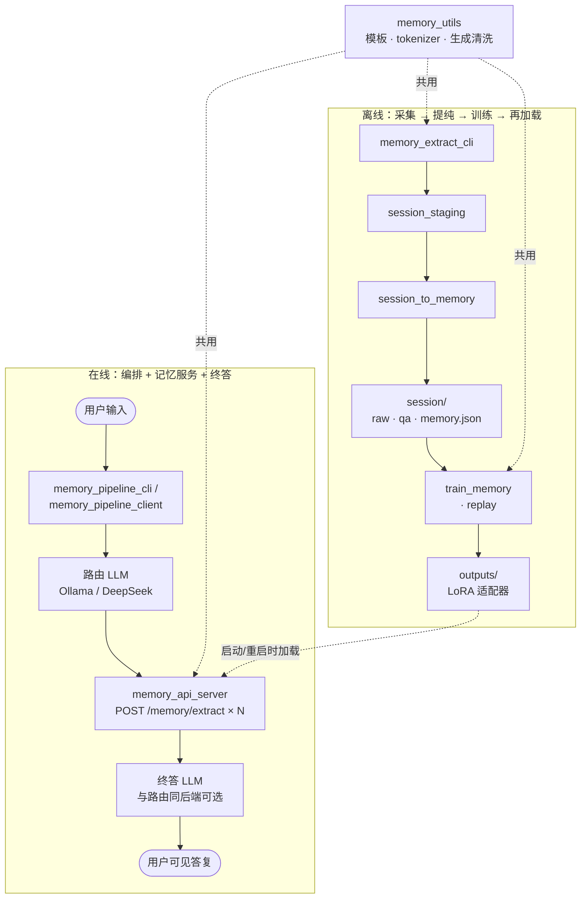

# 记忆模块技术方案

本文档以**本仓库实现**为主：架构分层、技术选型（基座、LoRA、Tokenizer、提示词、编排与 API 边界）、流程对接、踩坑清单与多用户演进思路。与 **RAG + 向量库** 的对照仅在文末**一节**作浓缩说明；文中认知/神经科学类比均为**工程隐喻**，非生物学结论。

**`记忆模型/2.0` 副本**：不含 `train_memory.py`、`train_memory_replay.py`、`download_hf_tokenizer.py`、`hf_tokenizer/` 及 `outputs/` 训练产物；训练与 tokenizer 离线准备见 **`记忆模型/1.0/`**。下文中的训练脚本与表项描述整体架构及 1.0 管线。

---

## 1. 目标与能力边界

- **目标**：在「个人/会话事实」维度上，让助手能根据**自然语言 query** 从已内化记忆中**生成**相关陈述，并在上层流水线中与路由、终答模型组合成完整对话体验。
- **边界**：记忆以 **HF 因果语言模型 + LoRA 适配器** 形式存在，不是独立向量库；长文档百科、多租户海量 KB 等应另选 RAG 或混合架构（见第 10 节）。

---

## 架构总览（示意图）

下图串联**在线**与**离线**两条链路，与下一节「**2. 架构分层**」中的各角色对应；`memory_utils` 为训练与推理侧公共逻辑，不进入编排进程的 HF 依赖。

**读图要点**：`memory_pipeline_cli` / `memory_pipeline_client` 仅 HTTP 调 `memory_api_server` 与外部 LLM，**不**加载 HF；`memory_api_server` 单进程持有 **基座 + LoRA**，承担多次检索式抽取。  
**补充**：亦可由浏览器访问 **`memory_pipeline_server`** 内嵌页（`chat_ui.html`）完成同编排链路的对话；`session_staging` / `session_chat` / `session/*.raw.txt` 的侧车读写与 §7.1 一致。

---

## 2. 架构分层：服务层、客户端与训练侧

承接上图，下表按**层级**归纳各模块依赖与职责。

| 层级 | 代表文件 | 依赖重点 | 职责 |
|------|----------|----------|------|
| **记忆抽取服务层** | `memory_api_server.py` | FastAPI、torch、transformers、peft、**本机 GPU** | 进程常驻，加载「基座 + LoRA」，对外 **HTTP** `POST /memory/extract`。 |
| **编排（客户端 / 服务）** | `memory_pipeline_cli.py`、`memory_pipeline_client.py`、`memory_pipeline_server.py`、`memory_pipeline_core.py`、`chat_ui.html` | 标准库 `urllib` + `session_to_memory` 的 **messages 级** DeepSeek/Ollama 调用（`deepseek_chat_messages` 等） | **不** import transformers / peft；`memory_pipeline_server` 持有进程内 `SESSIONS`、服务端 `session_staging`、**`session_chat/`**（浏览器多轮全量 JSON）；同进程提供 **浏览器单页**（内嵌 `chat_ui.html`）；连 HTTP 服务优先 **右键运行** `memory_pipeline_client.py`（改 `BUILTIN_*`）；`memory_pipeline_cli --client` 为可选等价路径。 |
| **单机记忆交互** | `memory_extract_cli.py` | 与 API 同构的加载与生成 | 调试、采集 `session_staging`。 |
| **训练与回放** | `train_memory.py`、`train_memory_replay.py` | 与 `memory_utils` 一致的数据构造与 QLoRA | 产出写入 `outputs/<子目录>/` 的适配器。 |
| **会话提纯（离线写入）** | `session_to_memory.py` | Ollama 或 DeepSeek HTTP | 判定是否入库、JSON 记忆、raw/qa 落盘。 |
| **公共库** | `memory_utils.py` | tokenizer、生成、清洗、门控、**与训练/推理共用的 system 文本** | 单一真相源，避免 API 与 train 行为漂移。 |

**为何把 `memory_api_server` 做成独立服务层**

1. **显存与启动成本**：基座 + 4bit 加载只应发生**一次**，多轮、多路 `memory_queries` 反复 HTTP 调用即可，避免每条请求在子进程里重复加载权重。  
2. **依赖隔离**：流水线、提纯脚本若直接 `import` 大模型，会把 **torch / CUDA / HF** 绑进所有入口；当前设计下 **编排文件不依赖 HF**，换路由模型、换机器部署编排时不必安装训练栈。  
3. **客户端语义**：`memory_pipeline_cli.py` 仅通过 `http://.../memory/extract` 消费服务，与调用其它微服务一致，便于以后换实现（例如另一台机器上的推理服务）而**不改客户端逻辑**。  
4. **局域网拆分**：`memory_api_server` 默认绑定 **`127.0.0.1`**（仅本机）；多机或另一台电脑访问时需 **`--host 0.0.0.0`**（或 `::`）。`memory_pipeline_server` 默认 **`::`**：实现上对 **`[::]:port` 建套接字并尽量 `IPV6_V6ONLY=0`**，常见 **`netstat` 同时出现 `[::]:port` 与 `0.0.0.0:port`**，便于本机 IPv4/IPv6 与 **CGNAT 环境下试用 IPv6 入站**；仅本机可 **`--host 127.0.0.1`**。流水线用 `--memory-api-base` 指向内网 IP；GPU 集中在一台，CPU 笔记本只跑编排。

**`session_to_memory` 被流水线引用的原因**：仅复用 **与 HF 无关** 的 `ollama_chat`、`deepseek_chat`、`_clean_model_text`；若希望编排与提纯**零共享**，可将 chat 抽到独立小模块（当前为减少文件数而共用）。

---

## 3. 基座模型选型

| 常量 / 行为 | 含义 |
|-------------|------|
| `memory_utils.DEFAULT_BASE_MODEL` | 默认 **`Qwen/Qwen2.5-7B-Instruct`**：中文指令跟随、对话模板成熟，与「记忆抽取 + 简短作答」任务匹配度高。 |
| `FALLBACK_BASE_MODEL` | **`deepseek-ai/DeepSeek-R1-Distill-Llama-8B`**：`train_memory` 在 `--fallback_model` 且主模型加载失败时切换；结构为 Llama，**词表与 Qwen 不同，不可混用 tokenizer**。 |
| `train_memory` 中 `BUILTIN_MODEL` | 默认等于 `DEFAULT_BASE_MODEL`；训练前应用 **`train_memory` 与 `memory_api_server` 的 `--base_model` 与适配器内 `adapter_config.json` 一致**，否则推理分布偏移。 |

**选型原则（落地）**

- 优先 **Instruct / Chat** 类因果模型，便于 `chat_template` 与 system/user 角色固定。  
- 参数量与显存：默认 7B + QLoRA 在 16GB 级显卡可训可查文档内注释（OOM 时降 `max_seq_length` 或 `lora_r`）。  
- 更换基座 = 重新全量训练 LoRA + 全链路 tokenizer 与模板对齐，**不是**热插拔权重文件即可。

---

## 4. 为何采用 LoRA / QLoRA，而非全参数微调

| 维度 | 全参数微调 | 本仓库 QLoRA（`bitsandbytes` 4bit + `peft.LoraConfig`） |
|------|------------|--------------------------------------------------------|
| 显存 | 高 | 显著降低，单卡可训 7B 级 |
| 存储与版本 | 整模型多份 | **仅保存适配器目录**（+ 训练时顺带 `tokenizer.save_pretrained`），便于版本化、回滚、多实验目录 |
| 风险 | 易灾难性遗忘整模型先验 | 低秩适配主要调节与记忆数据相关的方向，基座通用能力保留相对多 |
| 推理 | 同全参部署体量 | `PeftModel.from_pretrained(base, adapter_dir)`，与 `memory_api_server` 现状一致 |

`train_memory.py` 中 LoRA 超参示例：`target_modules` 覆盖 attention 与 MLP 的线性层（`q_proj`、`k_proj`、`v_proj`、`o_proj`、`gate_proj`、`up_proj`、`down_proj`），`r`/`alpha`/`dropout` 见脚本顶部 **内置默认**；注释说明在 RTX 5070 Ti 16GB 上的取向及 OOM 时如何下调。

**不采用全参的主要原因**：在「个人记忆」数据规模下，全参性价比低、显存与备份成本高；LoRA 已能绑定 **同一套 `SYSTEM_EXTRACT` + `[记忆提取]`** 的强约束行为。

---

## 5. Tokenizer 与「本地模型」利用方式

**Tokenizer 不是可选附件**：chat 模板拼接、训练样本 `format_qa_sample` / `format_raw_sample` 都依赖与**基座一致**的 tokenizer。

| 手段 | 作用 |
|------|------|
| `memory_utils.load_tokenizer` / `load_tokenizer_for_inference` | 训练与推理入口；存在 **`MEMORY_TOKENIZER_PATH`** 时优先从该目录加载。 |
| 环境变量 **`MEMORY_TOKENIZER_PATH`** | 指向已下载完整的 tokenizer 目录，绕过在线拉取。**`记忆模型/2.0` 不再内置 `hf_tokenizer/` 目录**；离线准备 tokenizer 可参考 **`记忆模型/1.0`**。 |

**踩坑**

- **禁止**把 DeepSeek-Llama 词表与 Qwen 基座混用，否则中文退化为极少 token，推理输出异常；`memory_utils` 内有中文编码探针，失败时会打印明确排错指引。  
- 国内网络：各脚本在 **import transformers 之前** 设置 `HF_ENDPOINT`（如 hf-mirror）、`HF_HUB_DOWNLOAD_TIMEOUT`、`HF_HUB_DISABLE_XET` 等，与 `train_memory` 文档一致，**勿**仅在 `main()` 里设环境变量（已太晚）。

**「本地模型」两层含义**

1. **基座权重**：仍来自 Hugging Face Hub ID，可缓存到本机 HF cache；非 GGUF 本地路径（当前管线为 PyTorch + PEFT）。  
2. **Tokenizer 与 LoRA**：tokenizer 可完全离线目录；LoRA 在 `outputs/<MEMORY_LORA_DIRNAME>/`，**纯本地路径**加载。

---

## 6. 提示词工程：避免穷举陷阱 + 用「固定条数」把穷举交给模型

**穷举陷阱**：在 system 里罗列大量「例如：天气、外卖、口味…」会诱导模型 **照抄示范域**、僵化「应从哪些角度检索」的示例罗列，且维护成本极高。当前做法是在 **`memory_utils.SYSTEM_EXTRACT`**、**`memory_pipeline_core.py` 的 `SYSTEM_ROUTER` / `SYSTEM_FINAL`**、**`session_to_memory.py` 的提纯提示** 中改为 **维度与约束的抽象表述**（禁止偷换维度、禁止元话语、终答禁止替用户做主等），**不提供**领域穷举清单。

**固定条数 `memory_queries`（与 `BUILTIN_ROUTER_MEMORY_QUERIES_TOP_N` 对齐）**

- 路由 **`SYSTEM_ROUTER`** 与代码共用同一 **`BUILTIN_ROUTER_MEMORY_QUERIES_TOP_N`**（脚本顶部常量，默认 **5**）：提示词要求 **`need_memory=true` 时 `memory_queries` 恰好 N 条**，按相关性排序；**不在提示词里**写满示例角度列表，由模型自行分解以满足条数与去重。  
- 编排侧 **不再对模型返回的条数做「只取前 N 条」截断**；若条数 ≠ N 会打 **警告日志**，以与「恰好 N 条」约定对齐。  
- 工程上：下游对每条问句调用一次记忆 API（`memory_api_server`），等价 **N 路线索**；**改 N 只改一处常量**即可与提示词、调用次数一致。  
- **路由输出**：DeepSeek 使用 **`response_format=json_object`**（非 reasoner）；Ollama 使用 **`format=json`**；解析失败会 **重试一次**，仍失败则 **抛错**（不接受用自然语言顶替 JSON）。  
- **终答前 think 文案**：仅当合并后的 **【已检索记忆】** 非空时提示「已检索到记忆事实…」；否则为「未命中可用记忆，正在直接生成回答…」（见 `memory_pipeline_core._final_stage_think_message`）。

**与记忆抽取的配合**：每条 `memory_queries` 独立 POST `/memory/extract`；编排将路由问句与抽取正文格式化为 **`[记忆检索]：` / `[记忆事实]：`** 两行一段写入终答的【已检索记忆】，字段含义在 **`SYSTEM_FINAL`** 中统一约定（见 `memory_pipeline_core.py`）。

---

## 7. 流程对接一览

**在线（编排）**

1. `memory_pipeline_cli`（本机 REPL）或 `memory_pipeline_server`（HTTP，会话与 `session_staging` / `session_chat` 在服务端）；连该 HTTP 时 **右键运行** `memory_pipeline_client.py`（或 `memory_pipeline_cli --client`）：路由 →（可选）最多 N 次 `POST .../memory/extract` → 终答；多轮对话 history 以 messages 传入模型。  
2. 大模型后端：deepseek（OpenAI 兼容 URL）或 ollama（在对应脚本 / 运行配置中选后端）；与记忆 API **分离**。  

### 7.1 浏览器对话页（`chat_ui.html` + `memory_pipeline_server`）

单页由 **`GET /`、`/ui`、`/index.html`** 返回（`chat_ui.html` 经占位符替换子标题后内嵌）；与编排共用 **`memory_pipeline_server`** 进程与端口（默认 **`8890`**，`BUILTIN_HOST` 默认 **`::`**，见 §2「局域网拆分」与实现中双栈监听）。左侧导航与 HTTP 侧车能力如下（**均为同域相对路径**，无单独前端工程）。

| 区域 | 行为 | 主要 HTTP |
|------|------|-------------|
| **对话** | `POST /sessions` 取 `session_id`；`POST /sessions/{id}/chat` 支持 `stream:true`（SSE：`think` / `delta`，末 `data: [DONE]`）。输入框为 **textarea**：**Enter** 发送；**Alt / Ctrl / Cmd + Enter** 由脚本插入换行（浏览器对 Alt/Ctrl+Enter 默认不换行）。 | 同上 |
| **今日会话** | 列出 **`session_staging/` 根目录下所有普通文件**（不递归），点击用 **`GET /today-session-content?name=<文件名>`** 预览纯文本。 | `GET /today-sessions` → `{"files":[{"name","mtime"},…]}` |
| **历史会话** | 列出 **`session_chat/*.json`**；**仅「打开会话」**，不展示 JSON 原文侧栏。`POST /session-chat/open` **`{"filename"}`** 后：服务端按文件恢复 `SESSIONS` 与 `history`，响应 **`{session_id, turns}`**；前端清空线程并按 `turns` 还原气泡（含 `think` / `assistant`）。若该 `session_id` 已在内存且 **`chat_dump_path` 指向同一文件**，返回 200 供本页重新铺 UI（避免 409）。 | `GET /session-chat/files`、`POST /session-chat/open` |
| **记忆库** | 扫描 **`session_raw/`** 下所有 **`*.raw.txt`**，点击用 **`GET /memory-bank/raw-content?rel=<相对 session_raw/ 的路径>`** 预览。 | `GET /memory-bank/raw-files`、`GET /memory-bank/raw-content` |

**落盘约定（与实现对齐）**

- **`session_staging/`**：每轮终答后追加文本块（`memory_pipeline_core.append_session_staging_turn`）；HTTP 会话对应文件名为 **`cli_<YYYYMMDD>_<HHMMSS>_<session_id>.txt`**，与 **`POST /sessions` 返回的 `session_id`**（`session_` + 17 位时间到毫秒 + 6 位循环计数；旧数据可为 32 位 hex）一致，便于目录检索。  
- **`session_chat/`**：创建会话时写入 **`chat_<YYYYMMDD>_<HHMMSS>_<session_id>.json`** 骨架；每轮成功后追加一条 `turn`，含 **`user`、`think`、`think_events`（SSE 控制侧）、`stream_deltas`（流式增量）、`assistant`**（终稿）。用于历史 UI 还原与审计；与 `session_staging` 并行，职责不同。  
- **`session_raw/`**：离线提纯产物（`年-月-日/*.raw.txt` 等），由 **`session_to_memory`** 写入；**记忆库**侧车只读展示 `*.raw.txt`。  
- **`session/`**：可由 **`memory_session_raw_merge.py`** 写入合并语料 `all_<时间>_corpus.txt`（与记忆库扫描无关）。

其它：`GET /ping`、`GET /health` 自检；**`SessionState`** 含 `session_id`、`history`、`staging_path`、`chat_dump_path`、`created_at`。

**离线（写入与巩固）**

1. `memory_extract_cli` 或 staging 文本 → `session_to_memory` → `session_raw/.../*.memory.json`、`*.raw.txt`、`*.qa.jsonl`。  
   - **右键无参**：由 **`BUILTIN_STAGING_ON_RUN`**（`all` / `latest`）决定处理 `session_staging` 下 **全部**或**仅最新** `cli_*.txt`；**`BUILTIN_NEGATIVE_QA`** 控制 QA 是否含负向「未记录」样本（默认关）；步骤日志为 **1/4～4/4**（判断 → 二阶段事实 → 提取 JSON → 生成 QA）。  
2. `train_memory` / `train_memory_replay` → `outputs/...` LoRA。  
   - **`train_memory_replay`** 从已有 **`PeftModel.from_pretrained`** 继续训练时，须 **`is_trainable=True`** 并解冻 **`lora_*` 参数**（否则会出现 **trainable params: 0**、白跑）。  
3. 重启或热加载策略由部署决定：`memory_api_server` 启动时加载指定 `--adapter_dir`。

**一致性检查清单**

- `[记忆提取]` 前缀、`SYSTEM_EXTRACT` / `SYSTEM_RAW`：训练与 `build_extract_messages` **必须**一致。  
- `MEMORY_LORA_DIRNAME` 与 `memory_api_server --adapter_dir`、训练 `output_dir` **必须**一致（或刻意做 A/B 目录时文档化）。  
- `adapter_config.json` 中 `base_model_name_or_path` 与当前启动 `base_model`：`memory_api_server` 会打 **警告** 若不一致。

---

## 8. 踩坑与运维要点（摘要）

| 现象 | 可能原因 | 处理 |
|------|----------|------|
| tokenizer 中文 0 token | 镜像损坏、错用其它基座词表 | 设置 `MEMORY_TOKENIZER_PATH` 指向完整 tokenizer 目录；删坏缓存；见 **1.0** |
| CUDA OOM | seq 过长、batch、lora_r 过大 | 降 `BUILTIN_MAX_SEQ_LENGTH`、`BUILTIN_LORA_R` 等 |
| 记忆「胡说」或格式飘 | 基座与 adapter 不匹配、训练数据脏 | 对齐 base id；清洗 session |
| 流水线报 DeepSeek 402 | 账户余额不足 | 充值或在编排入口中改用 ollama 后端 |
| API Key 写死在仓库 | 泄露、误提交 | 生产改环境变量；轮换 Key |
| 路由问句乱、终答收窄过度 | 模型未守提示 | 已用抽象规则 + 终答「禁止替用户做主」；可调 N 或换更强路由模型 |
| **`train_memory_replay` 日志里 trainable params 为 0** | `PeftModel.from_pretrained` 默认推理冻结 | 代码已 **`is_trainable=True`** + 解冻 **`lora_*`**；仍异常则查 PEFT 版本 |
| **公网 IPv4 端口映射做了仍不通（4G）** | 光猫 WAN 为 **100.64.0.0/10（CGNAT）** | 非「没配好」：全球公网 IPv4 **通常进不来**；内网访问 `http://WAN_IP:外网口` 多为 **NAT 回环**。可选：**运营商公网 IPv4**、**IPv6 入站**（光猫/本机防火墙）、**Tailscale / frp / Cloudflare Tunnel** |
| **`[::1]:port` 拒绝连接** | 仅监听 `0.0.0.0`、无 IPv6 套接字 | `memory_pipeline_server` 用 **`--host ::`**（默认已 `::`）+ 双栈 `bind`；`netstat` 应见 **`[::]:port`** |

---

## 9. 演进：从单用户到多用户

当前默认：**单套 LoRA + 单套 session 目录树**，适合个人助手或单租户 PoC。

**成熟后多用户常见做法（选型，非当前代码默认）**

1. **每用户一套 LoRA 目录**（推荐思路清晰）：`outputs/user_{id}/` 或 `MEMORY_LORA_DIRNAME` 按用户区分；`memory_api_server` **多实例**（每用户一进程一端口）或 **网关**根据 `user_id` 转发到对应 adapter 的 worker（需自行加路由层与鉴权）。  
2. **单进程多适配器**：PEFT 支持切换 adapter，但需管理显存与锁；实现复杂度高于多进程。  
3. **数据隔离**：`session/` 下按 `user_id/YYYY/MM/DD/` 分树，训练脚本扫描时只收该用户数据，避免样本串味。  
4. **共享基座 + 多 LoRA**：所有用户同一 `from_pretrained` 基座权重一份，多组 LoRA 按需挂载，节省磁盘与部分显存（仍要注意并发显存峰值）。

**与 RAG 混合**：多用户共享向量库 + 每用户 LoRA 记「偏好与经历」也是常见产品形态（见第 10 节）。

---

## 10. 与 RAG + 向量库（浓缩对照）

| 项 | RAG + 向量库 | 本方案 |
|----|--------------|--------|
| 检索机制 | embedding + Top-K chunk | 路由生成 N 条问句 + LoRA 条件生成 |
| 离线巩固 | 非必须（入库即索引） | **提纯 + QLoRA** 显式巩固 |
| 可解释性（工程 + 隐喻） | **单元证据**：chunk id、原文片段、相似度分数 | **链路证据**：终答上下文中 **`[记忆检索]` / `[记忆事实]`** 成对可读（路由问句 + 抽取结果）；**隐喻层（非生物学断言）**：离线 `session_to_memory` 重放会话筛选要点、再经训练写入 LoRA，**对外说明**时可类比**海马体回放 + 记忆巩固**（经历先编码、静息/离线阶段再巩固到长时存储），与「仅入库向量、无独立巩固叙事」形成对照 |
| 适用 | 长库、冷启动、多文档 | 个人短事实、强个性化、少维护向量栈 |

**可作替代**（中小规模、少运维）；**可作拓展**（向量管文档、LoRA 管用户私域）。上表「隐喻」仅用于产品/方案沟通中的**直觉对齐**，不作神经科学结论。

---

## 11. 模块速查表（文件级）

| 文件 | 一句话 |
|------|--------|
| `memory_utils.py` | 模板、tokenizer、生成、清洗、门控、LoRA 目录名。 |
| `memory_api_server.py` | FastAPI 记忆抽取服务。 |
| `memory_extract_cli.py` | 终端调试与 staging 采集。 |
| `memory_pipeline_core.py` | 编排核心：路由（**JSON 强制** + 解析重试）/ 多次 extract / 终答；多轮 ``history``（user/assistant）拼进 OpenAI messages；**`BUILTIN_ROUTER_MEMORY_QUERIES_TOP_N`** 与提示条数一致、**不截断** `memory_queries`。 |
| `memory_pipeline_server.py` | 流水线 HTTP 服务：进程内会话、`session_staging`、`session_chat`；浏览器页 API；DeepSeek 终答可 SSE 流式；默认 **`::` 双栈监听** `8890`。 |
| `chat_ui.html` | 浏览器单页：侧栏对话·今日会话·历史会话·记忆库；流式渲染与历史还原（无单独构建步骤）。 |
| `memory_pipeline_client.py` | 右键运行连接 `memory_pipeline_server`；无命令行参数，改文件内 `BUILTIN_*`。 |
| `memory_pipeline_cli.py` | 本机 REPL；可选 ``--client`` 连上述服务；【已检索记忆】为 `[记忆检索]` / `[记忆事实]` 两行一段拼接。 |
| `session_to_memory.py` | 离线提纯：会话 → memory JSON、raw、qa（默认落盘 **`session_raw/年-月-日/`**）；**`BUILTIN_STAGING_ON_RUN`** / **`BUILTIN_NEGATIVE_QA`**；多文件 staging 时可选 **tqdm** 进度条。 |
| `memory_session_raw_merge.py` | 将 **`session_raw/`** 下按 **stem** 合并为 **`session/all_<时间>_corpus.txt`**：每个 stem **先**一行 raw（行内换写 ``\\n``），**再**该 stem 的 `.qa.jsonl` **一行一条 QA**；标签顺序 **t→q→a**（`<AI_time>` 可选）；不含 `.memory.json`。 |
| `train_memory.py` / `train_memory_replay.py` / `download_hf_tokenizer.py` | 仅 **`记忆模型/1.0/`**；2.0 不含。 |

---

## 12. 文档维护

- 代码变更时同步更新：**基座 ID、默认端口、环境变量名、LoRA 默认目录名、路由条数 N（`BUILTIN_ROUTER_MEMORY_QUERIES_TOP_N`）**、**`memory_pipeline_server` 默认 `BUILTIN_HOST`（`::` / 双栈）**、**`memory_api_server` 默认监听地址**、**`session_to_memory` 的 `BUILTIN_STAGING_ON_RUN` / `BUILTIN_NEGATIVE_QA`**、**`train_memory_replay` 继续训练与 LoRA 解冻相关逻辑**。  
- **`memory_pipeline_server` 与 `chat_ui.html`**：新增或变更 **`/session-chat/*`、`/memory-bank/*`、`/today-*`** 等侧车路径、目录约定（`session_chat` / `session_staging` 文件名规则）、键盘与输入框行为时，**同步改本节与 §7.1**。  
- **公网访问**：若涉及 **CGNAT（如 WAN 100.64.x）/ IPv6 入站 / 隧道**，与本节 §8 表格及 §2 拆分说明对齐，避免文档仍写「仅改端口映射即可全球 IPv4 访问」。  
- 第三方 API 计费与模型 ID 以厂商文档为准。
